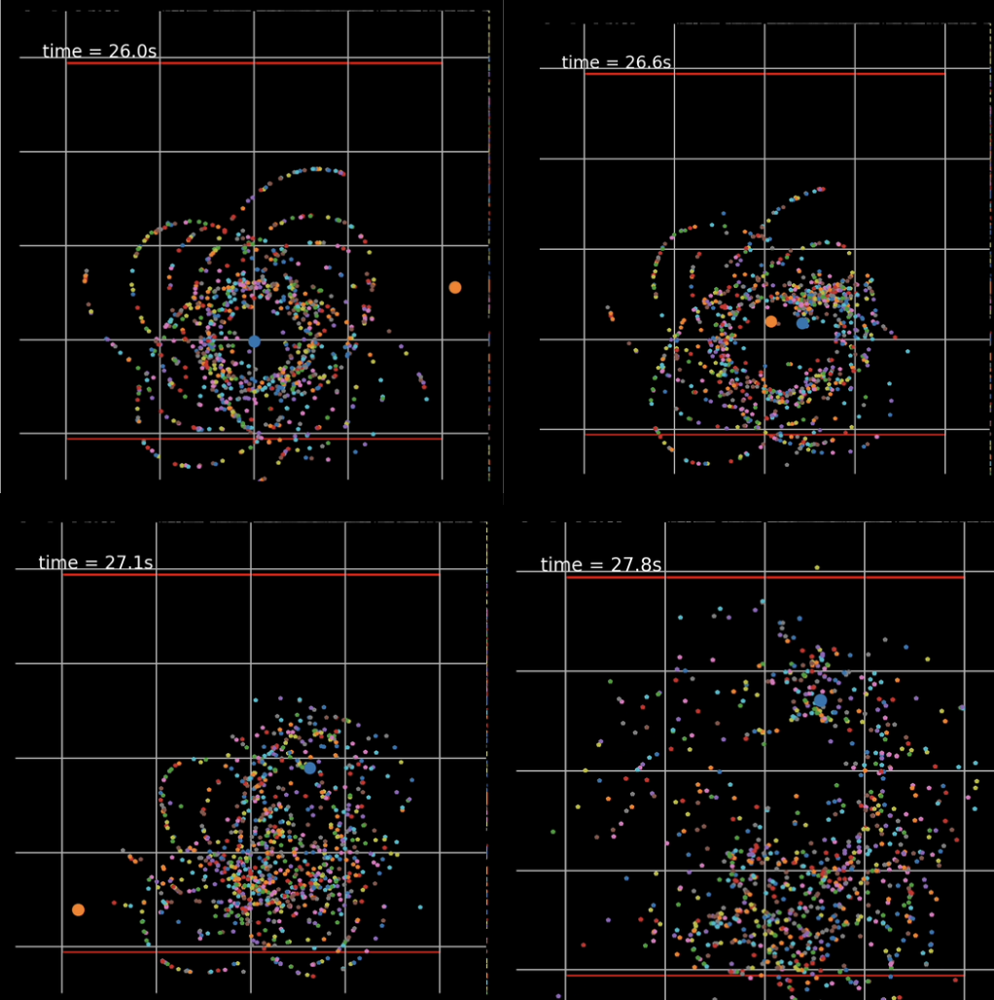

# N-Body Simulation using the Barnes-Hut Algorithm

This repository contains an implementation of the **Barnes-Hut algorithm** for simulating gravitational interactions between multiple bodies. The method optimizes calculations by dividing space into a **quadtree** (or **octree** in 3D) and approximating forces using the center of mass, significantly reducing computational complexity.

## Project Description

This Python program simulates and visualizes the gravitational dynamics of an \(N\)-body system using **object-oriented programming** and numerical methods.

### Key Features:
- **Particle Initialization**:
  - Bodies are initialized with random positions and velocities.
  - Includes particles and a massive central object representing a black hole.
- **Gravitational Force Calculation**:
  - Uses the **Barnes-Hut algorithm** with a quadtree to divide space and approximate forces in distant regions.
- **Dynamic Simulation**:
  - Integrates equations of motion using a time step (\( \Delta t \)).
  - Visualizes the system's evolution with animations.

## Requirements

The following Python libraries are required:
- `numpy`: For efficient numerical calculations.
- `matplotlib`: For generating visualizations and animations.
- `tqdm`: For displaying progress bars.

Install them with:
```bash
pip install numpy matplotlib tqdm
```

## Main Files

- **`galaxy.py`**: The core implementation of the Barnes-Hut algorithm, including:
  - `vector` class: Handles vector operations such as dot product and magnitude.
  - `Particle` class: Represents the system's bodies.
  - `Node` and `QuadTree` classes: Implement the quadtree for space division and optimization.
  - Simulation function: Executes system dynamics and generates animations.

## Usage Instructions

1. Clone this repository:
   ```bash
   git clone https://github.com/your-username/galaxy-simulation.git
   cd galaxy-simulation
   ```
2. Run the script:
   ```bash
   python galaxy.py
   ```
3. View the generated animation in a new window.

## Configurable Parameters

Inside the `galaxy.py` file, you can adjust the following parameters:
- `N`: Number of particles in the system.
- `dt`: Time step for integration.
- `M_bh`: Mass of the central massive object (e.g., a black hole).
- `t`: Total simulation duration.
- `G`: Universal gravitational constant.

## Example Output

The program generates a simulation where bodies orbit a central massive object, illustrating how gravitational forces shape their trajectories.

### Example Animation:
The simulation displays real-time evolution of particle trajectories computed using the Barnes-Hut algorithm.

## Contributions

Contributions are welcome! Feel free to open an issue or submit a pull request if you have ideas for improvement or encounter any issues.

## Author
**Diego Antonio Villalba González**  
Developed as part of an Astrophysics Computational project at Facultad de Ciencias, UNAM.



